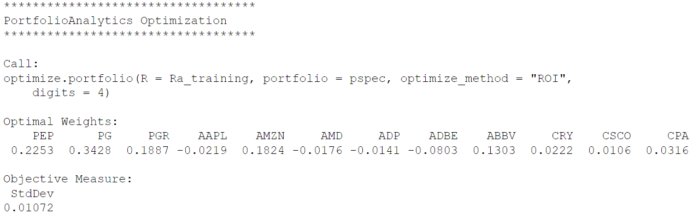
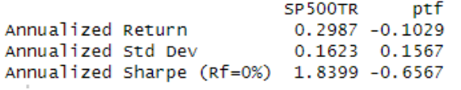

# Mean-Variance Portfolio Optimization with SP500 stocks

Mean-Variance portfolio optimization with six years of [Yahoo Finance](https://finance.yahoo.com/) SP500 and SP500TR end-of-day quotes from 
2016-2021 (18+ million rows). The project aims to perform asset allocation considering a group of stock tickers and find an optimal portfolio for 
the target investor. Portfolio tested against the SP500TR index to evaluate 2021 performance and provide risk assessment.

Utilized PortfolioAnalytics on R with extracted datasets stored in PostgreSQL for selecting the best weight distribution of the selected tickers. 

## Packages Used
PostgreSQL 14
- SQL
  
R 4.3.0
- PortfolioAnalytics
- ggplot2
- RPostgres
- DBI
- reshape2
- zoo

## ETL

ETL initialized using three different datasets from a PostgreSQL stocks database:
- custom calendar - trading calendar; contains a previous trading day column for calculating daily returns.
- daily prices - SP500 end-of-day quotes.
- eod indices - SP500TR end-of-day quotes.

Transformation
- Percentage of completeness (>= 99%) and outlier removal (daily return > 100%) enforced to assure data quality. 
- Imputed missing data items with the previous date's data. Up to three in a row were allowed to be imputed.

## Optimization 

Optimization uses the minimum acceptable return of the SP500TR index for the 2016-2020 time period. The model reflects "shorts" with a negative 
weight (e.g., AAPL, ADBE, ADP, and AMD), and those that have the highest fluctuations are the lower values. The largest portions of the optimized 
portfolio are stable, low-risk leading companies (e.g., PG, PGR, AMZN, and PEP) that provide reliable returns throughout the year. 

The sum of portfolio ticker weights is always equal to 1. 

## Evaluation

Annualized stats are used to compare the portfolio against the SP500TR index. In this example of Q1 2021 (above stocks), low annualized Sharpe 
ratios will reveal a volatile, non-diversified portfolio. Statistics within the range of the index provide a good measure for the highest possible 
returns with low-risk investments. 

## Notes
Personal DB credentials omitted in code.

Data retrieved from https://finance.yahoo.com/

