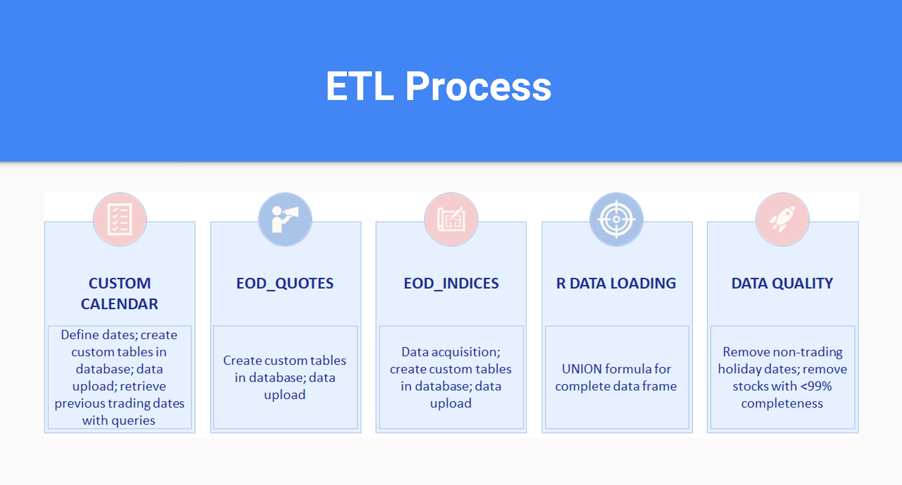

# Mean-Variance Portfolio Optimization for SP500 stocks (2016-2021)

Mean-Variance (MV) portfolio optimization with six years of daily SP500 data from 2016-2020 and Q1 2021 for testing. Analysis done on R using extracted Yahoo finance data stored in PostgreSQL.

## ELT

To initialize the ETL, I utilized three different data sets from a database I created on PostgreSQL. 
- Custom calendar to reflect the trading days on NYSE for the desired date range, 01/01/2021-03/26/2021. Generated an additional column creating previous trading date for daily return calculations.
- 
. For the first data set regarding the custom calendar, we created a custom calendar to analyze the desired date range, 01/01/2021-03/26/2021. Accounting for holidays when banks were closed and not trading, the value of trading day results on any holidays coded to zero. The data needed to upload to a custom_calendar table linked to the stockmarket_gp database and one more customized column for the previous trading date. For the second data set regarding eod_quotes, the data needed to upload to an eod_quotes table in the stockmarket_gp database. For the third and final data set regarding eod_indices, a .csv file to upload to an eod_indices table in the stockmarket_gp database originating from Yahoo finance indices data in the desired date range.

## Optimization 
Optimization uses the minimum acceptable return of the SP500TR index for the 2016-2020 time period. 

## Packages Used
SQL

R
- PortfolioAnalytics
- ggplot2
